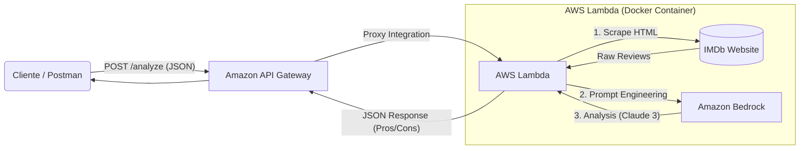

# 🎬 AI-Powered Movie Review Analyst (RAG Architecture)


Este proyecto implementa un pipeline **RAG (Retrieval-Augmented Generation)** 100% serverless en AWS. El sistema extrae reseñas de películas en tiempo real, las procesa utilizando Modelos de Lenguaje (LLMs) y expone un análisis de sentimiento estructurado a través de una API pública.

## 🏗️ Arquitectura de la Solución

El sistema sigue una arquitectura orientada a eventos y basada en contenedores para garantizar la portabilidad y la escalabilidad.



## 🚀 Stack Tecnológico

- **Computación:** AWS Lambda (Arquitectura ARM64/Graviton).
- **Empaquetado:** Docker & Amazon ECR (para gestión de dependencias complejas y paridad de entorno).
- **IA Generativa:** Amazon Bedrock (Modelo: Anthropic Claude 3 Sonnet).
- **Exposición:** Amazon API Gateway (HTTP API).
- **Lenguaje:** Python 3.12 (Boto3, BeautifulSoup4).
- **Infraestructura:** Gestionada mediante AWS Console & CLI.

## ✨ Características Clave

- **Análisis en Tiempo Real:** No utiliza bases de datos pre-cargadas; los datos se obtienen en el momento de la petición.
- **Salida Estructurada:** Utiliza técnicas de _Prompt Engineering_ y limpieza de datos (`raw_decode`) para garantizar que el LLM siempre devuelva un JSON válido.
- **Soporte UTF-8:** Manejo correcto de caracteres especiales y tildes en la respuesta.
- **Arquitectura Híbrida:** El handler soporta tanto invocación directa (para tests) como eventos proxy de API Gateway.

## 🔌 Uso de la API

Puedes probar el sistema enviando una petición POST al endpoint público.

**Endpoint:** `POST https://3im37m910l.execute-api.eu-west-1.amazonaws.com/analyze`

**Ejemplo con cURL:**

```bash
curl -X POST "https://3im37m910l.execute-api.eu-west-1.amazonaws.com/analyze" \
     -H "Content-Type: application/json" \
     -d '{"url": "https://www.imdb.com/title/tt0068646/reviews"}'
```

**Respuesta de Ejemplo:**

```json
{
  "message": "Éxito",
  "data": {
    "sentiment": "Positivo",
    "summary": "Una obra maestra del cine...",
    "pros": [
      "Actuaciones legendarias",
      "Dirección impecable",
      "Guion profundo"
    ],
    "cons": ["Ritmo lento para audiencias modernas"]
  }
}
```

## 🛠️ Despliegue y Desarrollo Local

El proyecto utiliza un flujo de trabajo basado en Docker:

1.  **Construcción:** `docker build --platform linux/arm64 -t rag-review-scraper .`
2.  **Etiquetado:** `docker tag rag-review-scraper:latest <ECR_URI>:latest`
3.  **Subida:** `docker push <ECR_URI>:latest`
4.  **Despliegue:** Actualización de la imagen en la función Lambda.

---

_Proyecto desarrollado como parte de un portfolio de Cloud Engineering & AI._
